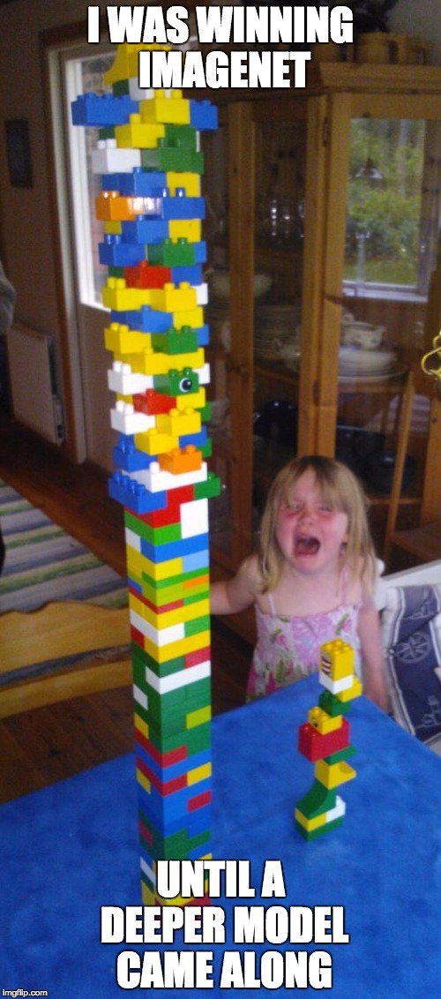

# Deep Residual Learning for Image Recognition

## Paper abstract
Deeper neural networks are more difficult to train. We present a residual learning framework to ease the training of networks that are substantially deeper than those used previously. We explicitly reformulate the layers as learning residual functions with reference to the layer inputs, instead of learning unreferenced functions. We provide comprehensive empirical evidence showing that these residual networks are easier to optimize, and can gain accuracy from considerably increased depth. On the ImageNet dataset we evaluate residual nets with a depth of up to 152 layers—8 x deeper than VGG nets but still having lower complexity. An ensemble of these residual nets achieves 3.57% error on the ImageNet test set. This result won the 1st place on the ILSVRC 2015 classification task. We also present analysis on CIFAR-10 with 100 and 1000 layers. The depth of representations is of central importance for many visual recognition tasks. Solely due to our extremely deep representations, we obtain a 28% relative improvement on the COCO object detection dataset. Deep residual nets are foundations of our submissions to ILSVRC & COCO 2015 competitions1, where we also won the 1st places on the tasks of ImageNet detection, ImageNet localization, COCO detection, and COCO segmentation.

## Summary

Well, basically the rule was like: "the deeper the networks, the better".
Indeed, as you must know, the inner advantage of NN is their natural ability to learn low/mid/high level features. So in theory, the “levels” of features can be enriched by the number of stacked layers (depth) and by the time many visual recognition tasks have greatly benefited from very deep models (ImageNet dataset).

So the paper was driven by this simple question: ***"Is learning better networks as easy as stacking more layers?"***
The short answer is NO! They showed empirically that when deeper networks are able to start converging, a degradation problem has been exposed: with the network depth increasing, accuracy gets saturated and then degrades rapidly (not caused by overfitting). In simple words, adding
more layers to a suitably deep model leads to higher train
ing error and test error.

This result is unexpected as a deeper model can theoretically match or even outperform a shallower one by copying its parameters and adding identity layers, but in practice, current optimization methods struggle to find such solutions efficiently.

## Ressources
- **Original Paper**: [Deep Residual Learning for Image Recognition](https://arxiv.org/abs/1512.03385)

- **YouTube:**
    - Aladdin Persson: [Pytorch ResNet implementation from Scratch](https://youtu.be/DkNIBBBvcPs?si=-LPA_Rj_1kWUbWSE)
    - Professor Bryce: [Residual Networks and Skip Connections (DL 15)](https://youtu.be/Q1JCrG1bJ-A?si=TdO_i4KQmSHVmSmg)
    - Maciej Balawejder: [ResNet | Paper Explained & PyTorch Implementation](https://youtu.be/wOuaGvxbtZo?si=hczOMHi88JhtHPVs)
    - Yannic Kilcher: [[Classic] Deep Residual Learning for Image Recognition (Paper Explained)](https://youtu.be/GWt6Fu05voI?si=j9VY8sEzpzICRrIG)
    - Priyam Mazumdar: [Going Deeper with Residual Connections: ResNet Implementation](https://youtu.be/TqIU9K8nNhs?si=U4jcyQs0t1qKCGRN)

## Futher explorations

> An obstacle to answering this question was the notorious problem of vanishing/exploding gradients, which hamper convergence from the beginning. This problem, however, has been largely addressed by normalized initial
ization and intermediate normalization layers, which enable networks with tens of layers to start converging for stochastic gradient descent (SGD) with backpropagation 

Papers to explore:
    - [ S. Ioffe and C. Szegedy. Batch normalization: Accelerating deep network training by reducing internal covariate shift. In ICML, 2015.]()
    - 